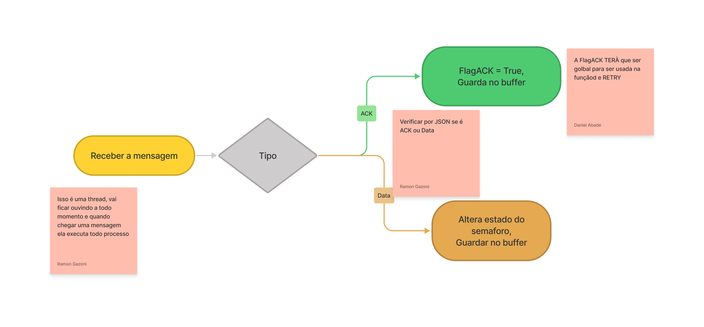

# Peer2peer Communication Project

### Esse projeto de faculdade é uma simples implementação de uma comunicação peer-2-peer. Cada host possui seu cliente e seu servidor local disposto numa porta alta (> 1023). A comunicação ocorre passando o Ip e a porta na qual se deseja comunicar. Para mais informações consulte <b>os requisitos do cliente</b> abaixo:

 

### Enviar mensagem para um outro programa na sua rede:

- O programa deve, minimamente, receber do usuário: 
    - IP do destino da mensagem; 
    - Mensagem; 
- Deve enviar a mensagem para o IP destinado especificado e deve confirmar que a mensagem foi entregue corretamente ao destino. 

 

### Ao  mesmo  tempo  (em  paralelo),  deve  ficar  aguardando  mensagens  oriundas  de qualquer destino e as exibindo na tela. 

- Deve confirmar o recebimento. 
- Deve exibir na tela do usuário (tratar o momento mais adequado para tal, 
haja visto que o usuário pode estar escrevendo uma mensagem para outro 
destino). 
- Após,  confirmar  o  recebimento  e  exibir  na  tela,  seu  programa  deve 
possibilitar  uma  resposta  direta  ao  remetente,  sem  a  necessidade  de  o 
usuário especificar o IP, pois a mensagem veio de uma fonte conhecida e 
deve ter sua resposta enviada a ela. 

 

### Para  essas  comunicações,  obrigatoriamente  utilize-se  de  um  json  com  as  seguintes informações: 

 

- Envio de mensagem: 
    - Ip_origem 
    - Ip_destino 
    - Porta_origem 
    - Porta_destino 
    - Timestamp da mensagem 
    - Mensagem 
 
  

- Mensagem de confirmação de recepção (ACK): 
    - Ip_origem 
    - Ip_destino 
    - Porta_origem 
    - Porta_destino 
    - Timestamp da mensagem original 
    - Timestamp da mensagem de resposta 
    - ACK (true ou false) 

  

- Mensagem de resposta: 
    - Ip_origem 
    - Ip_destino 
    - Porta_origem 
    - Porta_destino 
    - Timestamp da mensagem original 
    - Timestamp da mensagem de resposta 
    - Mensagem original 
    - Mensagem de resposta 

 
 

# Estruturação e arquitetura do projeto

 

Segue abaixo todas as arquiteturas e fluxos utilizados no programa. Esse tópico tem como finalidade, mapear funcionalidades de cada parte em jogo tanto o cliente, quanto o servidor. Além disso, temos um pequeno fluxo do programa.

 

## Fluxo do Servidor

 

 

## Fluxo do Servidor

 

## Fluxo do Cliente

 

 

 

 

# Referências bibliográficas

- https://realpython.com/intro-to-python-threading/#:~:text=A%20thread%20is%20a%20separate,time%3A%20they%20merely%20appear%20to.

- https://stackoverflow.com/questions/15729498/how-to-start-and-stop-thread

- https://manpages.debian.org/bullseye/manpages-dev/recv.2.en.html

- https://pythontic.com/modules/socket/udp-client-server-examplehttps://pythontic.com/modules/socket/udp-client-server-example

- https://docs.python.org/3/library/threading.html#threading.Lock

- https://www.geeksforgeeks.org/simple-chat-room-using-python/ 
